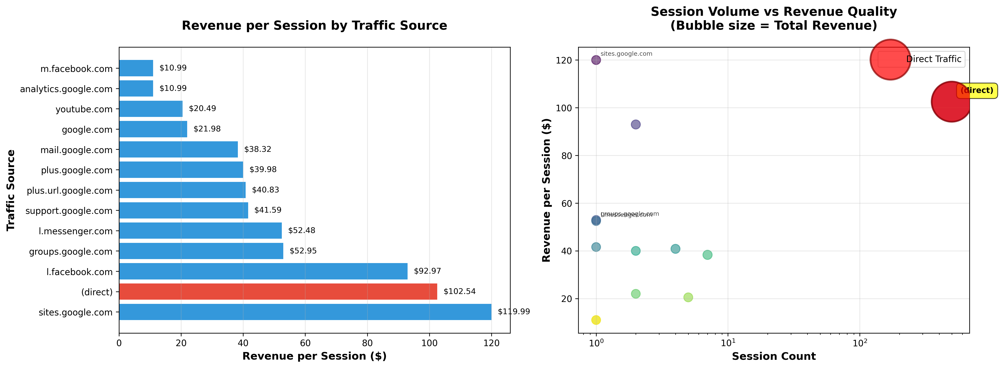

# Rill Demo Data Preparation Pipeline

A comprehensive data pipeline for processing Google Analytics Customer Revenue data, featuring data ingestion, transformation, and semantic layer integration with MotherDuck and DuckLake.

## Table of Contents

- [Overview](#overview)
- [Architecture](#architecture)
- [Features](#features)
- [Prerequisites](#prerequisites)
- [Security Notice](#security-notice)
- [Installation](#installation)
- [Project Structure](#project-structure)
- [Usage](#usage)
  - [Phase 1: Fill Data Swamp](#phase-1-fill-data-swamp)
  - [Phase 2: Filter Data Swamp](#phase-2-filter-data-swamp)
  - [Phase 3: Query with Semantic Layer](#phase-3-query-with-semantic-layer)
  - [Phase 4: MCP Server Integration](#phase-4-mcp-server-integration)
- [Data Models](#data-models)
- [Available Metrics](#available-metrics)
- [Example Analysis](#example-analysis)
- [Configuration](#configuration)
- [Troubleshooting](#troubleshooting)
- [Contributing](#contributing)

## Overview

This project processes the Google Analytics Customer Revenue Prediction dataset from [Kaggle](https://www.kaggle.com/competitions/ga-customer-revenue-prediction) through a multi-stage data pipeline. It transforms raw CSV data into structured fact tables, exports them to DuckLake/MotherDuck, and provides a semantic layer for easy querying and analysis.

## Example Analysis

## Available Metrics

### Dimensions (22 total)

#### Identity
- `session_id` - Unique session identifier
- `user_id` - Unique visitor identifier
- `session_number` - Sequential number for user

#### Time
- `session_date` - Date of session
- `session_start_time` - Session timestamp

#### Device
- `device_browser` - Browser used
- `device_os` - Operating system
- `device_category` - desktop/mobile/tablet
- `is_mobile` - Boolean mobile flag

#### Geography
- `continent` - Geographic continent
- `country` - Country name

#### Traffic
- `traffic_source` - Traffic source (google, direct, etc.)
- `traffic_medium` - Medium (organic, cpc, referral)
- `campaign` - Marketing campaign name

### Measures (21 total)

#### Volume
- `session_count` - Total sessions
- `user_count` - Unique users
- `new_users` - New user sessions

#### Engagement
- `total_pageviews` - Sum of pageviews
- `avg_pageviews` - Average pageviews per session
- `total_time_on_site` - Total time in seconds
- `avg_time_on_site` - Average session duration

#### Revenue
- `total_revenue` - Sum of transaction revenue (in micros)

## Example Analysis

### Traffic Source Revenue Analysis

Using the semantic layer, we can perform sophisticated analyses to understand traffic performance. Here's an example analyzing revenue by traffic source and medium:



#### Key Insights from the Analysis

**1. Direct Traffic Dominates Everything**
- 498 sessions generating $51,064.95 in revenue
- Revenue per session: $102.54
- Represents 97.8% of all revenue

**2. High-Value but Low-Volume Referrals**
- `sites.google.com`: $119.99/session (but only 1 session)
- `l.facebook.com`: $92.97/session (2 sessions)
- `groups.google.com`: $52.95/session (1 session)

**3. The Volume vs Quality Tradeoff**

The bubble chart (right panel) shows the classic analytics dilemma: direct traffic has both high volume AND high conversion quality. The referral sources show promise but need significantly more volume to validate their performance.

#### Strategic Questions This Raises

**What's driving direct traffic?** This unusually high direct traffic could indicate:
- Email campaigns not properly tagged
- Mobile app traffic
- Strong brand recognition with direct URL entry
- Potential tracking implementation issues

**Are the single-session sources outliers?** With only 1-2 sessions, sources like `sites.google.com` might be statistical noise rather than true indicators of quality traffic.

**Where's your organic/paid search?** The complete absence of organic or CPC traffic is notable. Possible explanations:
- Not running SEO/SEM campaigns
- Tracking not properly configured for these channels
- Operating in a niche where direct/referral is genuinely the primary acquisition method

## Architecture

```
┌─────────────────┐
│   Raw CSV Data  │ (train_v2.csv - 25GB)
└────────┬────────┘
         │
         ├─ Phase 1: Fill Data Swamp
         │  (fill_data_swamp_pipeline.py)
         ▼
┌─────────────────┐
│ Monthly Parquet │ (ga_sessions_YYYYMM.parquet)
│     Files       │
└────────┬────────┘
         │
         ├─ Phase 2: Filter Data Swamp
         │  (filter_data_swamp_pipeline.py)
         ▼
┌─────────────────┐
│  Local DuckDB   │ (data_swamp.duckdb)
│   + dbt Models  │ → src_sessions_fct, src_events_fct
└────────┬────────┘
         │
         ├─ Phase 3: Export Options
         │
         ├─────────────────┬───────────────────┐
         │                 │                   │
         ▼                 ▼                   ▼
┌──────────────┐  ┌─────────────┐  ┌──────────────┐
│Local DuckLake│  │ MotherDuck  │  │Boring Semantic│
│  (SQLite)    │  │  (Cloud)    │  │    Layer      │
└──────────────┘  └─────────────┘  └──────────────┘
                                            │
                                            ▼
                                    ┌──────────────┐
                                    │  MCP Server  │
                                    │   (Claude)   │
                                    └──────────────┘
```

## Features

- **Scalable Data Processing**: Handles large datasets (25GB+) efficiently using chunked processing
- **Multi-Stage Pipeline**: Separate ingestion and transformation stages for flexibility
- **dbt Transformations**: SQL-based transformations with deduplication and JSON parsing
- **Multiple Export Options**:
  - Local DuckDB for development
  - Local DuckLake for columnar storage
  - MotherDuck for cloud-based analytics
- **Semantic Layer**: Query-friendly interface with 22 dimensions and 21 measures
- **MCP Integration**: Claude Desktop integration via Model Context Protocol
- **Rich Logging**: Colorful console output with detailed pipeline execution logs

## Prerequisites

- **Python**: 3.11 or higher
- **Google Cloud Platform** (optional): For GCS bucket access
- **MotherDuck Account** (optional): For cloud exports
- **System Requirements**:
  - At least 32GB RAM recommended for processing large datasets
  - 50GB+ free disk space

## Security Notice

**IMPORTANT: This project uses sensitive credentials that must NEVER be committed to version control.**

Before committing:
1. Verify `.gitignore` is in place
2. Never commit files containing:
   - GCP private keys
   - MotherDuck tokens
   - Database credentials
   - API keys

**Template files are provided:**
- `filter_data_swamp/.dlt/secrets.toml.example`
- `fill_data_swamp/.dlt/secrets.toml.example`

Copy these to `secrets.toml` and fill in your actual credentials. The `.gitignore` file ensures `secrets.toml` files are never tracked by git.

## Installation

1. **Clone or download the project:**
   ```bash
   cd rill_demo_data_prep
   ```

2. **Create a virtual environment:**
   ```bash
   python -m venv .venv
   source .venv/bin/activate  # On Windows: .venv\Scripts\activate
   ```

3. **Install dependencies:**
   ```bash
   pip install -e .
   ```

   Or install manually:
   ```bash
   pip install "boring-semantic-layer[fastmcp,viz-altair,viz-plotly]>=0.1.12" \
               "dbt-core>=1.10.13" \
               "dbt-duckdb>=1.9.6" \
               "dlt[dbt,duckdb,ducklake,filesystem,gs,parquet]>=1.12.1" \
               "duckdb>=1.4.1" \
               "ibis-framework[duckdb]>=11.0.0" \
               "pandas>=2.3.3" \
               "polars>=1.34.0" \
               "rich>=13.0.0"
   ```

4. **Download the dataset:**
   - Get `train_v2.csv` from [Kaggle](https://www.kaggle.com/competitions/ga-customer-revenue-prediction/data)
   - Place it in `data/landing_zone/train_v2.csv`

5. **Install dbt dependencies:**
   ```bash
   cd filter_data_swamp/data_swamp_models
   dbt deps
   cd ../..
   ```

## Project Structure

```
rill_demo_data_prep/
├── README.md                           # This file
├── pyproject.toml                      # Project dependencies
├── data/
│   └── landing_zone/
│       └── train_v2.csv               # Raw GA data (25GB)
├── fill_data_swamp/
│   ├── README.md                      # Phase 1 documentation
│   ├── fill_data_swamp_pipeline.py    # CSV → Monthly Parquet
│   └── .dlt/                          # dlt config & secrets
│       ├── config.toml
│       └── secrets.toml
└── filter_data_swamp/
    ├── README.md                      # Phase 2 documentation
    ├── filter_data_swamp_pipeline.py  # Main ETL pipeline
    ├── duck_lake_party.py             # Local DuckLake export
    ├── ducks_flock_to_mother.py       # MotherDuck sync
    ├── boring_sessions_semantic_model.py  # Semantic model definition
    ├── boring_mcp_server.py           # MCP server for Claude
    ├── boring_query_examples.py       # Example queries
    ├── data_swamp_models/             # dbt project
    │   ├── dbt_project.yml
    │   ├── profiles.yml               # gordon_bombay profile
    │   ├── dependencies.yml           # dbt_utils
    │   └── models/
    │       └── sources/
    │           ├── sources.yml        # Source definitions
    │           └── src_sessions_fct.sql  # Main fact table
    └── .dlt/                          # dlt config & secrets
        ├── config.toml
        └── secrets.toml
```

## Usage

### Phase 1: Fill Data Swamp

Convert the massive CSV file into manageable monthly Parquet files.

```bash
cd fill_data_swamp
python fill_data_swamp_pipeline.py
```

**What it does:**
- Reads `train_v2.csv` using streaming (low memory mode)
- Identifies unique months in the dataset
- Processes the last 6 months by default (configurable)
- Outputs Parquet files: `ga_sessions_YYYYMM.parquet`
- Saves to `.dlt/pipelines/fill_data_swamp/analytics/tables/`

**Configuration:**
- Modify `months[0:3]` to `months` in line 74 to process all months
- Adjust chunk sizes or file paths as needed

### Phase 2: Filter Data Swamp

Load Parquet files into DuckDB and transform with dbt.

```bash
cd filter_data_swamp
python filter_data_swamp_pipeline.py
```

**What it does:**

1. **Extract**: Reads Parquet files in 100k row chunks
2. **Transform**:
   - Processes nested `hits` JSON arrays
   - Joins session and hit-level data
   - Loads into DuckDB `source_data` schema
3. **dbt Transformations**:
   - Creates `src_sessions_fct` with flattened JSON fields
   - Deduplicates sessions using dbt_utils
   - Parses device, geo, totals, and traffic_source JSON
4. **Optional Export**:
   - Sets up DuckLake database in MotherDuck
   - Exports `src_sessions_fct` to cloud storage

**Outputs:**
- `filter_data_swamp.duckdb` - Local DuckDB database
- `pipeline.log` - Detailed execution logs

### Phase 3: Query with Semantic Layer

Use the Boring Semantic Layer for easy querying.

#### Interactive Python Session

```python
from boring_sessions_semantic_model import sessions_sm

# Query sessions by device
result = sessions_sm.query(
    dimensions=["device_category"],
    measures=["session_count", "avg_pageviews"],
    order_by=[("session_count", "desc")]
).execute()

print(result)
```

#### Run Example Queries

```bash
cd filter_data_swamp
python boring_query_examples.py
```

This generates:
- Traffic source analysis
- Device category breakdown
- Time series trends
- Geographic distribution
- Revenue analysis
- Visualizations (PNG charts)

#### Query MotherDuck Directly

```python
import ibis
from boring_semantic_layer import SemanticModel

token = "your_motherduck_token"
con = ibis.duckdb.connect(f"md:?motherduck_token={token}")
sessions_tbl = con.table("src_sessions_fct", database="analytics")

models = SemanticModel.from_yaml(
    "sessions_semantic_model.yml",
    tables={"sessions_tbl": sessions_tbl}
)
sessions_sm = models["sessions"]

# Query
result = sessions_sm.query(
    dimensions=["geo_country"],
    measures=["session_count", "conversion_rate"]
).execute()
```

### Phase 4: MCP Server Integration

Enable Claude Desktop to query your data through MCP.

1. **Start the MCP server:**
   ```bash
   cd filter_data_swamp
   python boring_mcp_server.py
   ```

2. **Configure Claude Desktop:**

   Add to your Claude Desktop config (`~/Library/Application Support/Claude/claude_desktop_config.json` on macOS):

   ```json
   {
     "mcpServers": {
       "ducklake-sessions": {
         "command": "python",
         "args": [
           "/absolute/path/to/filter_data_swamp/boring_mcp_server.py"
         ]
       }
     }
   }
   ```

3. **Query in Claude:**
   - "Show me sessions by device category"
   - "What are the top traffic sources by session count?"
   - "Create a time series of daily sessions for the last month"

## Data Models

### src_sessions_fct (Sessions Fact Table)

Created by `filter_data_swamp/data_swamp_models/models/sources/src_sessions_fct.sql`

**Key Transformations:**
- Timestamp adjustment: `TO_TIMESTAMP(visit_start_time) - INTERVAL '7' MONTH + INTERVAL '7' YEAR`
- JSON field extraction from device, geo_network, totals, traffic_source
- Deduplication by `user_id` + `session_id` ordered by `session_start_time`
- Materialized as incremental table with append strategy

**Schema:**
- `session_key` - Unique DLT ID
- `session_id` - Visit ID
- `user_id` - Full visitor ID
- `session_number` - Sequential session for user
- `session_start_time` - Timestamp
- `session_date` - Date string
- Device fields: `browser`, `os`, `device_category`, `is_mobile`
- Geo fields: `continent`, `sub_continent`, `country`
- Totals: `visits`, `hits`, `pageviews`, `time_on_site`, `new_visits`, `transaction_revenue`
- Traffic: `referrer`, `source`, `medium`, `campaign`

#### Generating This Analysis

You can reproduce this analysis using the semantic layer:

```python
from boring_sessions_semantic_model import sessions_sm

# Query revenue by traffic source and medium
revenue_analysis = sessions_sm.query(
    dimensions=["traffic_source", "traffic_medium"],
    measures=["session_count", "total_revenue"],
    filters=[
        {"field": "total_revenue", "operator": ">", "value": 0}
    ],
    order_by=[("total_revenue", "desc")]
).execute()

# Create visualization
chart = revenue_analysis.chart(spec={
    "title": "Revenue by Traffic Source",
    "mark": {"type": "bar", "color": "steelblue"}
})
chart.save("revenue_by_source.png")
```

This example demonstrates the power of combining dlt's data pipeline with the Boring Semantic Layer for rapid business insights.

## Configuration

### dlt Configuration

Located in `.dlt/config.toml` and `.dlt/secrets.toml` in each pipeline directory.

**Example `fill_data_swamp/.dlt/config.toml`:**
```toml
[sources.filesystem]
bucket_url = "file:///path/to/data/landing_zone"
file_glob = "*.csv"

[destination.filesystem]
bucket_url = "file:///_storage"
```

**Example `filter_data_swamp/.dlt/secrets.toml`:**
```toml
[destination.motherduck.credentials]
database = "analytics"
password = "your_motherduck_token"
```

### dbt Configuration

Located in `filter_data_swamp/data_swamp_models/profiles.yml`

**Profile: gordon_bombay**
```yaml
gordon_bombay:
  outputs:
    dev:
      type: duckdb
      path: "{{ env_var('DBT_DUCKDB_PATH', 'data_swamp.duckdb') }}"
      schema: source_data
  target: dev
```

## Troubleshooting

### Common Issues

#### Out of Memory Errors

**Problem**: Processing crashes with memory errors

**Solution**:
- Reduce chunk size in `filter_data_swamp_pipeline.py` (line 65)
- Process fewer months in `fill_data_swamp_pipeline.py` (line 70)
- Increase system swap space

#### File Not Found Errors

**Problem**: Cannot find CSV or Parquet files

**Solution**:
- Check file paths in `.dlt/config.toml`
- Ensure `train_v2.csv` is in `data/landing_zone/`
- Verify dlt pipeline completed successfully in Phase 1

#### dbt Model Failures

**Problem**: dbt transformations fail

**Solution**:
```bash
cd filter_data_swamp/data_swamp_models
dbt debug  # Check configuration
dbt deps   # Reinstall dependencies
dbt run --full-refresh  # Force rebuild
```

#### MotherDuck Connection Issues

**Problem**: Cannot connect to MotherDuck

**Solution**:
- Verify token in `.dlt/secrets.toml`
- Check network connectivity
- Ensure database exists: `CREATE DATABASE analytics`
- Try local DuckLake export instead: `python duck_lake_party.py`

#### MCP Server Not Working

**Problem**: Claude Desktop cannot connect

**Solution**:
- Use absolute paths in `claude_desktop_config.json`
- Restart Claude Desktop after config changes
- Check server logs for errors
- Ensure Python environment is activated

### Debug Mode

Enable verbose logging:

```python
import logging
logging.basicConfig(level=logging.DEBUG)
```

Check pipeline logs:
```bash
tail -f filter_data_swamp/pipeline.log
```

## Contributing

This is a demo project for showcasing dlt, DuckDB, DuckLake, and Boring Semantic Layer capabilities. Feel free to adapt for your own use cases.

### Extending the Pipeline

**Add New dbt Models:**
```bash
cd filter_data_swamp/data_swamp_models/models
# Create new SQL file
dbt run --select your_model_name
```

**Add Semantic Layer Dimensions/Measures:**

Edit `filter_data_swamp/boring_sessions_semantic_model.py`:

```python
dimensions={
    # Add new dimension
    "your_dimension": DimensionSpec(
        expr=lambda t: t.your_column,
        description="Your description"
    ),
}
```

**Export to Additional Destinations:**

The dlt pipeline supports many destinations. Update `filter_data_swamp_pipeline.py`:

```python
pipeline = dlt.pipeline(
    pipeline_name="filter_data_swamp",
    destination="snowflake",  # or bigquery, postgres, etc.
    dataset_name="source_data"
)
```

## License

This project uses data from the [Google Analytics Customer Revenue Prediction](https://www.kaggle.com/competitions/ga-customer-revenue-prediction) Kaggle competition. Please review Kaggle's terms of use for the dataset.

## Resources

- [dlt Documentation](https://dlthub.com/docs)
- [dbt Documentation](https://docs.getdbt.com)
- [DuckDB Documentation](https://duckdb.org/docs)
- [MotherDuck Documentation](https://motherduck.com/docs)
- [Boring Semantic Layer](https://github.com/datonic/boring-semantic-layer)
- [Model Context Protocol](https://modelcontextprotocol.io)

## Support

For issues and questions:
- Check pipeline logs in `filter_data_swamp/pipeline.log`
- Review the README files in each subdirectory
- Consult the documentation links above
